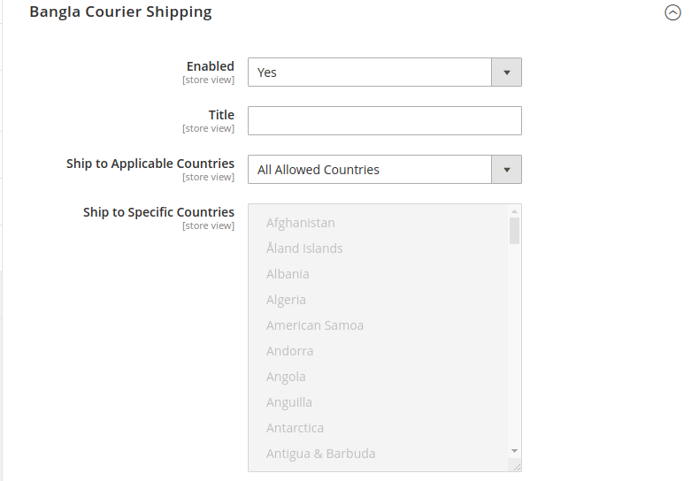
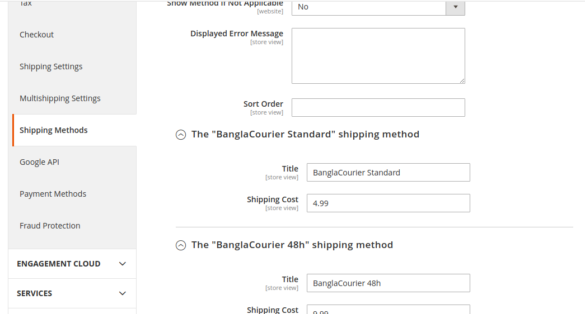
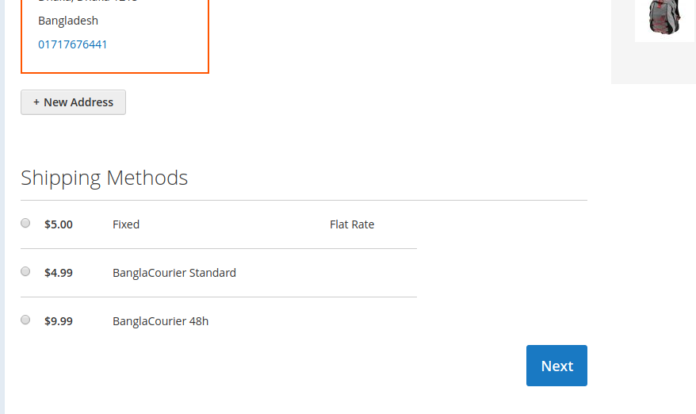

# BDC_BanglaCourier

This module is used as Offline Shipping methods of  Magento 2 extensions.
Customize Checkout Add custom shipping carrier.


## 1. How to install & upgrade BDC_BanglaCourier


#### 1.1 Copy and paste

If you don't want to install via composer, you can use this way.

- Download [the latest version here](https://github.com/bdcrops/module-banglacourier/archive/master.zip)
- Extract `master.zip` file to `app/code/BDC/BanglaCourier` ; You should create a folder path `app/code/BDC/BanglaCourier` if not exist.
- Go to Magento root folder and run upgrade command line to install `BDC_BanglaCourier`:

#### 1.2. Install via composer

We recommend you to install BDC_BanglaCourier module via composer. It is easy to install, update and maintaince.Run the following command in Magento 2 root folder.
```
composer config repositories.module-banglacourier git
https://github.com/bdcrops/module-banglacourier.git

composer require bdcrops/module-banglacourier:~1.0.0
php bin/magento setup:upgrade
php bin/magento setup:static-content:deploy
```
#### 1.3 Upgrade    

```
composer update bdcrops/module-banglacourier
php bin/magento setup:upgrade
php bin/magento setup:static-content:deploy
```
Run compile if your store in Product mode:
```
php bin/magento setup:di:compile
```

## 2 Manual Tutorial
- Create app/code/BDC/BanglaCourier/registration.php
```
<?php
\Magento\Framework\Component\ComponentRegistrar::register(
    \Magento\Framework\Component\ComponentRegistrar::MODULE,
    'BDC_BanglaCourier',
    __DIR__
);

```
- create app/code/BDC/BanglaCourier/etc/module.xml
```
<?xml version="1.0"?>

<config xmlns:xsi="http://www.w3.org/2001/XMLSchema-instance" xsi:noNamespaceSchemaLocation="urn:magento:framework:Module/etc/module.xsd">
    <module name="BDC_BanglaCourier" setup_version="1.0.0"/>
</config>

```
- create app/code/BDC/BanglaCourier/etc/config.xml
```
<?xml version="1.0" ?>

<config xmlns:xsi="http://www.w3.org/2001/XMLSchema-instance" xsi:noNamespaceSchemaLocation="urn:magento:module:Magento_Store:etc/config.xsd">
	<default>
		<carriers>
			<banglacourier>
				<active>1</active>
				<title>Bangla Courier Shipping</title>
				<sallowspecific>0</sallowspecific>
				<showmethod>0</showmethod>
				<specificerrmsg><![CDATA[The Bangla Courier shipping method is not available. To use this shipping method, please contact us.]]></specificerrmsg>
				<sort_order>10</sort_order>
				<model>BDC\BanglaCourier\Model\Carrier\BanglaCourier</model>

				<!-- The "Untracked Bangla Mail" specific options -->
				<banglacourierstandard>
					<title><![CDATA[BanglaCourier Standard]]></title>
					<shippingcost>4.99</shippingcost>
				</banglacourierstandard>

				<!-- The "Parcel Force 48hr" specific options -->
				<banglacourier48hr>
					<title><![CDATA[BanglaCourier 48h]]></title>
					<shippingcost>9.99</shippingcost>
				</banglacourier48hr>

			</banglacourier>
		</carriers>
	</default>
</config>

```
- create app/code/BDC/BanglaCourier/etc/adminhtml/system.xml
```
<?xml version="1.0" ?>
<config xmlns:xsi="http://www.w3.org/2001/XMLSchema-instance" xsi:noNamespaceSchemaLocation="urn:magento:module:Magento_Config:etc/system_file.xsd">
	<system>
		<section id="carriers">
			<group id="banglacourier" showInDefault="1" showInStore="1" showInWebsite="1" sortOrder="1" translate="label">
				<label>Bangla Courier Shipping</label>
				<!-- General shipping carrier options -->
				<field id="active" showInDefault="1" showInStore="1" showInWebsite="1" sortOrder="10" translate="label" type="select">
					<label>Enabled</label>
					<source_model>Magento\Config\Model\Config\Source\Yesno</source_model>
				</field>

				<field id="title" showInDefault="1" showInStore="1" showInWebsite="1" sortOrder="20" translate="label" type="text">
					<label>Title</label>
				</field>

				<field id="sallowspecific" showInDefault="1" showInStore="1" showInWebsite="1" sortOrder="30" translate="label" type="select">
					<label>Ship to Applicable Countries</label>
					<frontend_class>shipping-applicable-country</frontend_class>
					<source_model>Magento\Shipping\Model\Config\Source\Allspecificcountries</source_model>
				</field>

				<field id="specificcountry" showInDefault="1" showInStore="1" showInWebsite="1" sortOrder="40" translate="label" type="multiselect">
					<label>Ship to Specific Countries</label>
					<can_be_empty>1</can_be_empty>
					<source_model>Magento\Directory\Model\Config\Source\Country</source_model>
				</field>

				<field id="showmethod" translate="label" type="select" sortOrder="41" showInDefault="1" showInWebsite="1" showInStore="0">
					<label>Show Method if Not Applicable</label>
					<source_model>Magento\Config\Model\Config\Source\Yesno</source_model>
					<frontend_class>shipping-skip-hide</frontend_class>
				</field>

				<field id="specificerrmsg" showInDefault="1" showInStore="1" showInWebsite="1" sortOrder="50" translate="label" type="textarea">
					<label>Displayed Error Message</label>
				</field>

				<field id="sort_order" showInDefault="1" showInStore="1" showInWebsite="1" sortOrder="51" translate="label" type="text">
					<label>Sort Order</label>
					<validate>validate-number validate-zero-or-greater</validate>
				</field>

				<!-- The "BanglaCourier Standard" specific options -->
				<group id="banglacourierstandard" showInDefault="1" showInStore="1" showInWebsite="1" sortOrder="110" translate="label">
					<label><![CDATA[The "BanglaCourier Standard" shipping method]]></label>
					<fieldset_css>complex</fieldset_css>
					<field id="title" type="text" sortOrder="10" showInDefault="1" showInWebsite="1" showInStore="1">
						<label><![CDATA[Title]]></label>
					</field>

					<field id="shippingcost" type="text" sortOrder="20" showInDefault="1" showInWebsite="1" showInStore="1">
						<label><![CDATA[Shipping Cost]]></label>
						<validate>validate-number validate-zero-or-greater</validate>
					</field>
				</group>

                <!-- The  "BanglaCourier 48h" specific options -->
				<group id="banglacourier48hr" showInDefault="1" showInStore="1" showInWebsite="1" sortOrder="120" translate="label">
					<label><![CDATA[The "BanglaCourier 48h" shipping method]]></label>
					<fieldset_css>complex</fieldset_css>
					<field id="title" type="text" sortOrder="10" showInDefault="1" showInWebsite="1" showInStore="1">
						<label><![CDATA[Title]]></label>
					</field>

					<field id="shippingcost" type="text" sortOrder="20" showInDefault="1" showInWebsite="1" showInStore="1">
						<label><![CDATA[Shipping Cost]]></label>
						<validate>validate-number validate-zero-or-greater</validate>
					</field>
				</group>

			</group>
		</section>
	</system>
</config>

```
- create app/code/BDC/BanglaCourier/Model/Carrier/BanglaCourier.php
```
<?php

namespace BDC\BanglaCourier\Model\Carrier;

class BanglaCourier extends \Magento\Shipping\Model\Carrier\AbstractCarrier implements
    \Magento\Shipping\Model\Carrier\CarrierInterface {
    const CARRIER_CODE = 'banglacourier';
    const BANGLA_COURIER_STANDARD = 'banglacourierstandard';
    const BANGLA_COURIER_48HR = 'banglacourier48hr';

    protected $_code = self::CARRIER_CODE;
    protected $_isFixed = true;
    protected $_rateResultFactory;
    protected $_rateMethodFactory;

    /**
     * Constructor
     *
     * @param \Magento\Framework\App\Config\ScopeConfigInterface $scopeConfig
     * @param \Magento\Quote\Model\Quote\Address\RateResult\ErrorFactory $rateErrorFactory
     * @param \Psr\Log\LoggerInterface $logger
     * @param \Magento\Shipping\Model\Rate\ResultFactory $rateResultFactory
     * @param \Magento\Quote\Model\Quote\Address\RateResult\MethodFactory $rateMethodFactory
     * @param array $data
     */
    public function __construct(
        \Magento\Framework\App\Config\ScopeConfigInterface $scopeConfig,
        \Magento\Quote\Model\Quote\Address\RateResult\ErrorFactory $rateErrorFactory,
        \Psr\Log\LoggerInterface $logger,
        \Magento\Shipping\Model\Rate\ResultFactory $rateResultFactory,
        \Magento\Quote\Model\Quote\Address\RateResult\MethodFactory $rateMethodFactory,
        array $data = []
    ){
        $this->_rateResultFactory = $rateResultFactory;
        $this->_rateMethodFactory = $rateMethodFactory;
        parent::__construct($scopeConfig, $rateErrorFactory, $logger, $data);
    }

    /**
     * {@inheritdoc}
     */
    public function collectRates(\Magento\Quote\Model\Quote\Address\RateRequest $request){
        if (!$this->getConfigFlag('active')) {
            return false;
        }
        // $request->getPackageWeight();
        // $request->getPackageValue()

        // Init result object
        $result = $this->_rateResultFactory->create();
        if ($request->getAllItems()) {
            foreach ($request->getAllItems() as $item) {
                if ($item->getProduct()->isVirtual() || $item->getParentItem()) {
                    continue;
                }
                // todo: Any calculation/logic based on order items?
            }
        }

        $method = $this->_rateMethodFactory->create();
        $method->setCarrier($this->_code);
        $method->setCarrierTitle($this->getConfigData('title'));
        $method->setMethod(self::BANGLA_COURIER_STANDARD);
        $method->setMethodTitle($this->getMethodTitle($method->getMethod()));
        $method->setPrice($this->getMethodPrice($method->getMethod()));
        $method->setCost($this->getMethodCost($method->getMethod()));
        $method->setErrorMessage(__('The %1 method error message here.'));
        $result->append($method);

        $method = $this->_rateMethodFactory->create();
        $method->setCarrier($this->_code);
        $method->setCarrierTitle($this->getConfigData('title'));
        $method->setMethod(self::BANGLA_COURIER_48HR);
        $method->setMethodTitle($this->getMethodTitle($method->getMethod()));
        $method->setPrice($this->getMethodPrice($method->getMethod()));
        $method->setCost($this->getMethodCost($method->getMethod()));
        $method->setErrorMessage(__('The %1 method error message here.'));
        $result->append($method);

        return $result;
    }

    /**
     * This method is used in \Magento\Shipping\Model\Config\Source\Allmethods::toOptionArray()
     *
     * Which in turn is used with:
     * (1) Sales/cart rule condition, see https://goo.gl/goUKzU.
     * (2) Stores > Configuration > Sales > Clean Checkout > General > Default Shipping Method, see https://goo.gl/66aopF
     *
     * @return array
     */
    public function getAllowedMethods(){
        return [
            self::BANGLA_COURIER_STANDARD => $this->getConfigData(self::BANGLA_COURIER_STANDARD . '/title'),
            self::BANGLA_COURIER_48HR => $this->getConfigData(self::BANGLA_COURIER_48HR . '/title'),
        ];
    }


    /**
     * @param $method
     * @return false|string
     */
    private function getMethodTitle($method){
        return $this->getConfigData($method . '/title');
    }

    /**
     * @param $method
     * @return false|string
     */
    private function getMethodPrice($method){
        return $this->getMethodCost($method);
    }

    /**
     * @param $method
     * @return false|string
     */
    private function getMethodCost($method){
        return $this->getConfigData($method . '/shippingcost');
    }
}

```


- Admin Panel Sales & Shipping section Show as below:



- The Order Summary section of the Review & Payments step should also reflect on the method
selected in the Shipping step, as follows:




## Ref
- [Devdocs](https://devdocs.magento.com/guides/v2.3/howdoi/checkout/checkout-add-custom-carrier.html)
